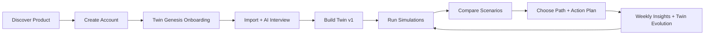
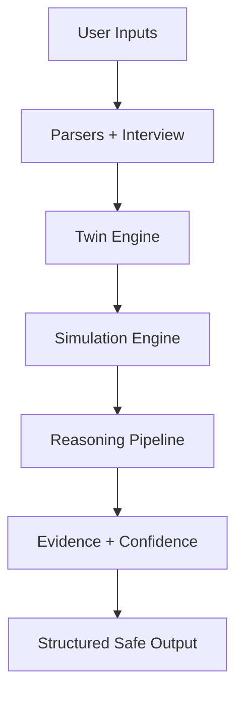

# CareerTwin AI

*Build your digital career twin and simulate your future.*


CareerTwin AI is a **career decision intelligence** product that helps professionals evaluate high-stakes career choices using a living digital twin, scenario simulations, and evidence-backed reasoning.  
This repository currently contains the **complete planning and architecture documentation** needed before implementation.

---

## Vision

CareerTwin AI exists to become the decision layer for career mobility: helping people test possible futures before committing years of life, while preserving user agency and explicitly communicating uncertainty.

---

## Problem Statement

Career decisions are often made with fragmented inputs:
- Static resumes and profile snapshots
- Generic advice and social pressure
- No personal simulation environment for tradeoff analysis

Who is affected:
- Professionals in role transitions
- People considering relocation, leadership, or entrepreneurship
- High-opportunity-cost users making irreversible career choices

Why this matters:
- Wrong career decisions can compound financial and emotional cost
- Decision paralysis delays growth
- Existing tools optimize artifacts (resume/profile), not decisions

---

## Solution

CareerTwin AI creates a continuously evolving **Digital Career Twin** using:
- Resume
- LinkedIn
- GitHub
- Portfolio
- AI interview
- Goals, preferences, constraints, and behavior signals

It then runs scenario simulations (for example: job switch, relocation, startup path, leadership path, upskilling path), returning:
- Recommendation options (not deterministic predictions)
- Assumptions and tradeoffs
- Evidence references
- Confidence bands
- Actionable next-step experiments

---

## Core Features

- **Twin Genesis Onboarding**: Guided setup that builds the first twin snapshot.
- **Multi-source Ingestion**: Resume, LinkedIn, GitHub, and portfolio parsing with provenance.
- **AI Career Interview**: Adaptive questioning to resolve ambiguity and contradictions.
- **Career Twin Engine**: Versioned identity model across skills, motivation, constraints, and risk profile.
- **Simulation Engine**: 2-5 scenario comparison across salary growth, skill growth, promotion probability, burnout risk, optionality, and work-life balance.
- **Evidence Engine**: Claim-level provenance and explainability.
- **Confidence Engine**: Confidence bands tied to data quality and model stability.
- **Decision Dashboard**: Priority actions, twin health, pending decisions, and simulation summaries.
- **Insights Feed**: Weekly strategic insights and timing alerts.
- **Report Generator**: Shareable decision reports with privacy controls.

---

## Product Workflow





---

## Repository Structure

| Path | Purpose |
|---|---|
| `00-Product-Strategy/` | Product vision, mission, market, personas, strategy, business model |
| `01-Product-Concept-Document/` | Complete product concept and interaction philosophy |
| `02-Product-Requirements-Document/` | Functional/non-functional requirements, stories, rules, acceptance criteria |
| `03-UI-UX-Specification/` | Full screen-by-screen UX behavior and state definitions |
| `04-System-Architecture/` | System design, stack, data flow, deployment, scalability |
| `05-AI-Architecture/` | AI subsystem architecture, reasoning, safety, monitoring |
| `06-Prompt-Engineering/` | Prompt patterns, schemas, versioning, eval and recovery |
| `07-Development-Roadmap/` | Delivery milestones, dependencies, complexity, risks |
| `08-Engineering-Review/` | Principal engineering readiness review and blockers |
| `09-Judge-Review/` | Hackathon-style final judging report and improvement priorities |
| `10-Engineering-Implementation/` | Implementation planning package (readiness, questions, blueprint, milestones, strategy) |

> Current repository state: **planning complete, product implementation not started**.

---

## Tech Stack

Planned stack (from architecture documents):

| Layer | Planned Choice |
|---|---|
| Frontend | React + TypeScript + Next.js |
| Backend | Node.js + TypeScript (Fastify or NestJS) |
| AI Orchestration | Python services (FastAPI) + workers |
| Database | PostgreSQL |
| Caching | Redis |
| Storage | S3-compatible object storage |
| Authentication | OIDC / OAuth2 |
| Queue/Event Bus | SQS/Kafka equivalent |
| Deployment | Kubernetes + managed cloud services |
| Testing | Unit + integration + contract + AI eval + performance tests |
| Monitoring | OpenTelemetry + centralized logs/metrics/traces |

---

## AI Architecture

The AI system is modular and safety-gated:

- **Input Modules**: Resume parser, LinkedIn analysis, GitHub analysis, portfolio analysis, AI interview engine
- **Core Intelligence**: Memory layer, context builder, twin engine, simulation engine
- **Trust Layers**: Evidence engine + confidence engine
- **Reasoning Pipeline**: Intent extraction → context assembly → scenario evaluation → tradeoff synthesis → safety filter → structured output
- **Function Calling**: Typed tool contracts for retrieval, simulation, reporting, and validation
- **Structured Outputs**: Strict JSON schema validation before downstream use
- **Safety Controls**:
  - No deterministic future claims
  - Prompt injection protections for untrusted imports
  - Hallucination mitigation via evidence-required generation
  - Policy filters and release gates

---

## Development Workflow

Current process reflected in docs:

1. **Planning**
   - Strategy, concept, requirements, UX, architecture, AI architecture, prompt design
2. **Readiness Review**
   - Engineering and judge reviews identify critical gaps and pre-dev gates
3. **Implementation Planning**
   - Blueprint, milestone map, and implementation strategy created
4. **Implementation (Next)**
   - Starts only after readiness gates are approved
5. **Testing and Hardening**
   - Contract, safety, performance, and reliability validation
6. **Deployment**
   - Controlled rollout with observability and rollback paths

---

## Getting Started

### Prerequisites

- Git
- Modern browser (for viewing documentation)
- Optional: local static file server

### Installation

```bash
git clone <repository-url>
cd CareerTwin-AI
```

### Environment Variables

Product runtime environment variables: **To be decided**  
(Implementation has not started; see `10-Engineering-Implementation/03-Engineering-Questions.html`.)

### Running Locally

This repository is currently documentation-first. Open any `index.html` in folders `00` to `10`, or serve locally:

```bash
python3 -m http.server 8080
```

Then visit [http://localhost:8080](http://localhost:8080).

### Development Commands

Implementation code commands: **To be decided**

### Build Commands

Application build pipeline: **To be decided**

---

## Coding Standards

Implementation coding standards are planned around:
- Strong domain boundaries (UI, API, AI, data, infra)
- Type-safe contracts and schema-validated AI outputs
- Explainability-first output design
- Security and privacy by default
- Testable, versioned prompt and model behavior

Detailed standards and decisions live in:
- `04-System-Architecture/`
- `05-AI-Architecture/`
- `06-Prompt-Engineering/`
- `10-Engineering-Implementation/`

Naming conventions and exact lint/format rules: **To be decided during implementation bootstrap**.

---

## Security

Security priorities documented:
- Explicit consent controls for integrations
- Encryption in transit and at rest
- Prompt injection protection and policy filters
- Auditability and traceability of recommendations
- Privacy-safe sharing and report generation

Still required before build starts:
- Full threat model
- Compliance mapping (GDPR/CCPA, DSAR, retention/deletion workflows)
- Secrets rotation policy
- Incident severity and response SLAs

Secrets/API keys for runtime: **To be decided**.

---

## Documentation

All core documentation is already available:

- `00-Product-Strategy/`
- `01-Product-Concept-Document/`
- `02-Product-Requirements-Document/`
- `03-UI-UX-Specification/`
- `04-System-Architecture/`
- `05-AI-Architecture/`
- `06-Prompt-Engineering/`
- `07-Development-Roadmap/`
- `08-Engineering-Review/`
- `09-Judge-Review/`
- `10-Engineering-Implementation/`

Recommended reading order:
1. `00` → `01` → `02`
2. `03` → `04` → `05` → `06`
3. `07` → `08` → `09` → `10`

---

## Roadmap

### Current MVP Scope (Planned)
- Twin onboarding
- Resume + LinkedIn import
- AI interview
- Baseline simulations and comparison
- Decision dashboard
- Basic report export

### Future Features (Planned)
- GitHub and portfolio intelligence depth
- Twin evolution diffs and calibration history
- Advanced insights and timing alerts
- Partner/institutional workflows

### Long-term Vision
CareerTwin AI evolves into career mobility infrastructure and a longitudinal decision intelligence platform.

---

## Contributing

Contributions are welcome. Because implementation has not started yet, current contributions are best focused on:
- Documentation quality
- Readiness gap validation
- Architecture and safety review feedback

### Contribution Guidelines

1. Review relevant source docs before proposing changes.
2. Keep proposals evidence-based and aligned with existing artifacts.
3. Prefer focused PRs with clear rationale.

### Branch Naming

Branch naming convention: **To be decided**

### Commit Messages

Commit message convention: **To be decided**

### Pull Request Process

PR checklist and review policy: **To be decided**

---

## License

**To be decided.**

---

## Contact

Project contact details: **To be decided.**
